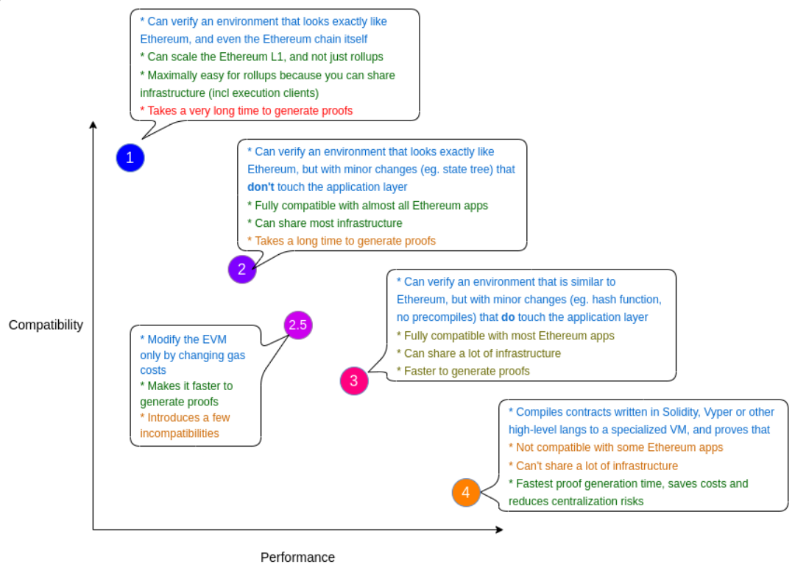

### What are ZK EVMs, part 1: Overview
We're starting to look at the VM part of zkEVM blockchains. In this lesson, we've covered several examples of them and more general theory.

A zkEVM is a virtual machine in the form of a ZK circuit designed to emulate EVM by recreating [all the opcodes](https://ethereum.org/en/developers/docs/evm/opcodes/) as well as other features of EVM blockchains such as gas costs.

While full compatibility with Ethereum is what most developers desire, in reality, this comes with a huge drawback in the form of higher complexity of the circuit and fewer final benefits like the throughput and fees on L2. Many L2 that implement zkEVM usually set some boundaries on the level of compatibility.

Visual representation of the said above [by Vitalik Buterin](https://vitalik.ca/general/2022/08/04/zkevm.html):

Remember [the picture](#day-3) with the EVM architecture? It defines the elements that a zkEVM has to emulate: Stack, Memory, and Storage plus contexts like gas counter, program counter, etc.

Timeline of zkEVM development:
2013 - TinyRAM
2018 - Spice
2020 - zkSync
2021 - Cairo VM
2022 - Polygon zkEVM / Scroll / RISC Zero
2023 - Powdr

I didn't know about Powdr up to this moment, but they have a pretty [website](https://www.powdr.org/) and documentation, so I'll check them later :)

