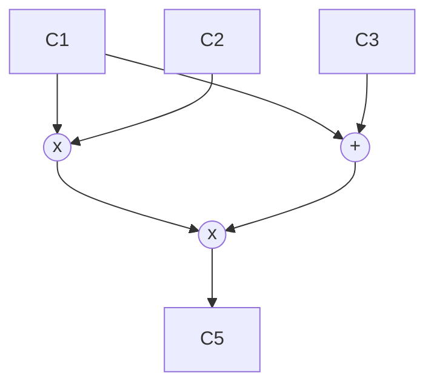

### What are ZK EVMs, part 2: Universal circuits/circuit compiler
EVM is a stack-based virtual machine. For example, if we want to add two numbers, 3 and 9, we first need to push them onto the stack and then call `ADD` opcode:
```asm
PUSH1 3
PUSH1 9
ADD
```

The zkEVM Prover we want to build has to compute all these small operations (create traces), which lead to changes in the blockchain's global state.

zkEVM Challenges:
- Limited support of Elliptic Curves on EVM
- Mismatched fields (native 256-bit words on EVM vs prime fields on zkEVM)
- Special EVM opcodes like `CALL` and errors
- Stack-based model. In practice, zkEVM works better with registers rather than stack. This is the reason why, for example, zkSync zkEVM is based on registers.
- Storage overhead. Ethereum uses Keccak and MPT for storage computations; both are not zk-friendly.
- Machine-based proof overhead

Significant advancements of the recent years in the field:
- Polynomial Commitment Schemes allow us to use polynomials with higher degrees.
- Lookup tables turn zk-unfriendly operations into precomputed mappings that allow us to save computation time. The biggest limitation here is that we have to include these tables, and it seems like we have a solution. Check out [this podcast](https://zeroknowledge.fm/274-2/) with Ariel Gabizon, especially the part about [Cached Quotients (cq)](https://eprint.iacr.org/2022/1763).
- Customized gates.
- Recursive proofs. Recent techniques made them more feasible compared to the previous approaches.
- Hardware acceleration. Specifically, developed hardware for zk-proof generation purposes or at least GPUs instead of CPUs can hugely boost any computations.

#### Gates
We use addition and multiplication gates similar to electric circuits in order to express our programs one step closer to pure polynomials.



Check out [this playlist](https://www.youtube.com/watch?v=RUZcam_jrz0&list=PLBJMt6zV1c7Gh9Utg-Vng2V6EYVidTFCC) by David Wong with more examples to see how these gates will become polynomials later.

#### Lookup tables and Custom gates
Instead of implementing some of the operations as general circuits (e.g., bitwise operations), we can add custom gates to our circuit with lookup tables. I think of them as mappings in Solidity where you can define which value => another value and use this operation instead of addition or multiplication.

#### Underconstrained code
When we write our circuits, we have to ensure that there are enough constraints because otherwise, it is possible to create proofs for erroneous inputs.
Check out [this writeup](https://medium.com/chainlight/uncovering-a-zk-evm-soundness-bug-in-zksync-era-f3bc1b2a66d8) by zkSync of a disclosed bug.

