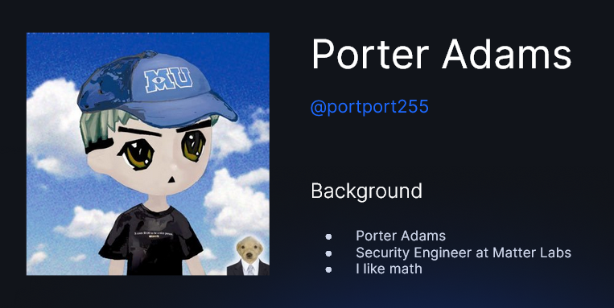

### Presentation by Porter Adams
Today was a less formal lesson where I finally had an opportunity to flex some knowledge because I've spent two weeks trying to figure out how zkSync works in the recent C4 contest :D

We've talked briefly about things that we previously learned in the other lessons but from a different perspective.
More interestingly, we discussed the security aspects of zk rollups and many of the common concerns that developers in the space are trying to solve:
- Cryptography weakness
- Centralization issues
- Interoperation between layers
- Trusted execution
- Infrastructure (e.g., backdoor in a dependency)

Later in the lesson, Porter showed us some very cool examples of vulnerabilities that were found in implementations of SNARK constraint systems. Underconstrained code is probably one of the most common mistakes developers make during development.

