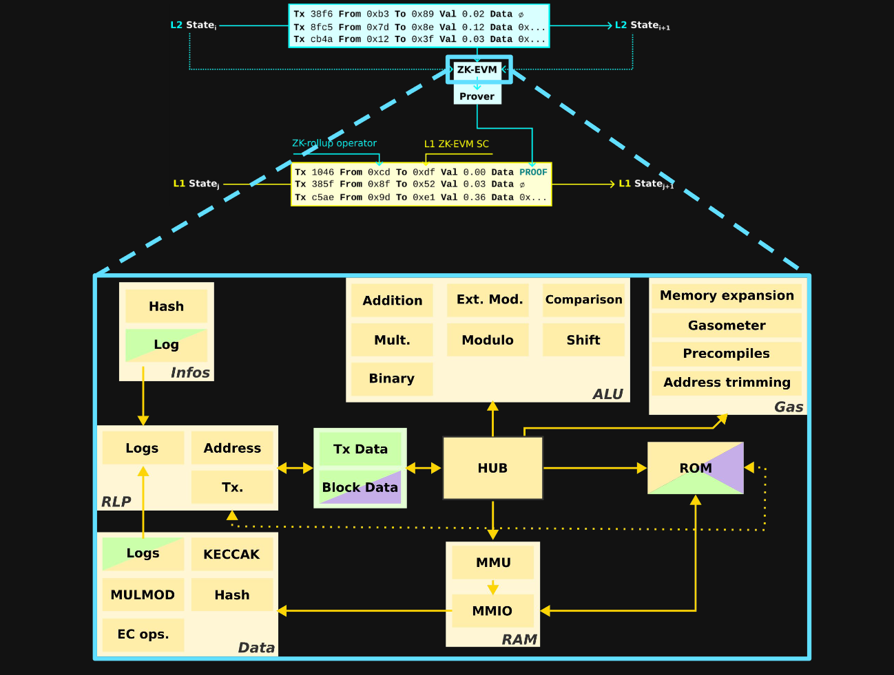
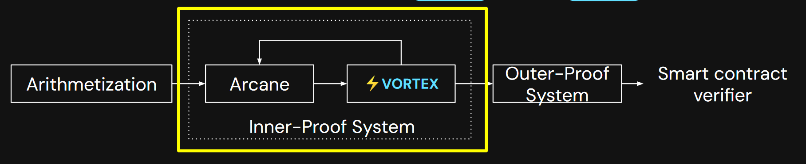

### Plonk, part 1: Linea
Two days ago, we talked about the trace tables, as you probably remember. We can express our gates or steps in the form of a table, which gives us a nice visual of the data that we use to generate proof.
Today, we've taken an example with the Fibonacci numbers, which you can read in more detail [here](https://medium.com/starkware/arithmetization-ii-403c3b3f4355).

### Presentation by Emily and Alexandre from Linea
Linea is a zk-rollup; it uses validity proofs to create batches of transactions and post them on L1. This part is quite common now.
Emily is a DevRel; Alexandre is a developer (he's working in the Prover team) of Consensys.

More interestingly, Linea has a Lisp-based DSL named Corset. I didn't hear about it before. They compile the language into Go and then use the program as an input to Vortex, a gnark-based prover.

The zkEVM circuit is a composition of different smaller circuits similar to zkSync.

Linea is a type 2 rollup (from Buterin's graph) because they use different hash functions, MiMC7 (instead of Keccak) and Sparse Merkle Trees (instead of Patricia Merkle Tree), which allows not storing the full tree.

The Prover of Linea has two parts:
- Inner system, Arcane, where all the traces are being "compiled" into a [homogeneous polynomial](https://en.wikipedia.org/wiki/Homogeneous_polynomial) and they use lattice-based hashes (cool!).
- The outer system, Vertex, compresses the output of the inner system and prepares it to be posted on the L1.

Lattice-based cryptography is a middle between SNARK-friendly hashes (MiMC, Poseidon) and traditional hashes (Keccak, SHA, Blake). 

