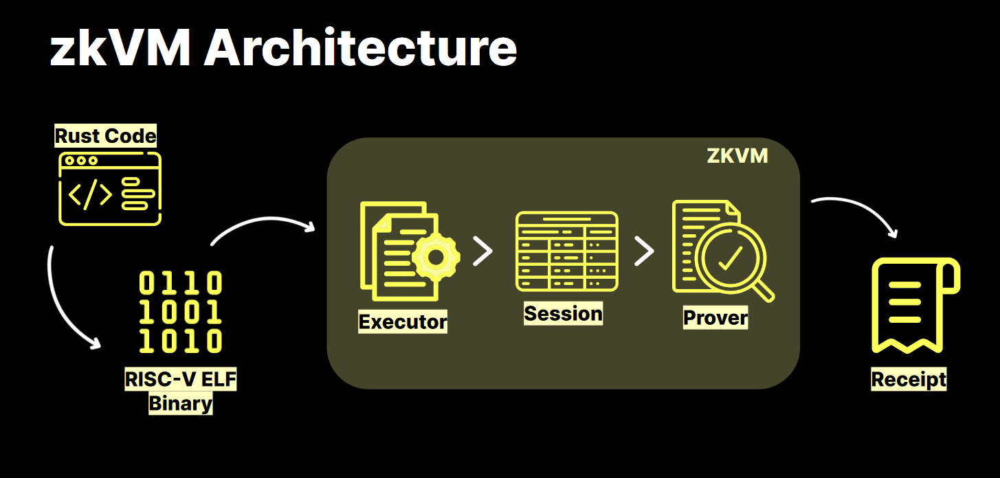

### Presentation by Iryna from RISC Zero
RISC Zero is a zkVM system that can run general-purpose verifiable code.

As any VM, it has a set of instructions: 32-bit [RISC-V](https://en.wikipedia.org/wiki/RISC-V), an open standard instruction set architecture (ISA) based on established reduced instruction set computer (RISC) principles.

For the zk part, it utilizes STARK. Read more in [the official documentation](https://dev.risczero.com/proof-system/stark-by-hand). 

Two main parts from the developer's perspective are:
- Host code, which the Prover or the Verifier will use.
- Guest code, which defines the program to verify.

#### Lifecycle
1. Guest code, which is a Rust program, is being compiled into RISC-V ELF binary.
2. Host code then takes the binary and inputs and generates a receipt.
3. The receipt can be sent to a Verifier to check whether the execution was correct.

#### Code example
You can see one in Homework 22. It's quite easy to set up. Check out [the Hello World tutorial](https://dev.risczero.com/api/zkvm/tutorials/hello-world) if you want to complete it yourself.

#### Proving-as-a-service
RISC Zero also provides a distributed proving service, Bonsai, that can be used to execute computation-heavy zkVM.

#### Zeth
The team won the [RFP#61](https://github.com/ethereum-optimism/ecosystem-contributions/issues/61) bid by Optimism to build a zk Fraud Proof program. Zeth is an implementation of EVM in zkVM.

