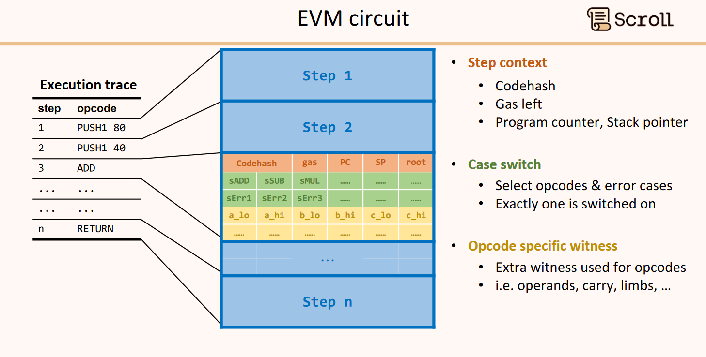
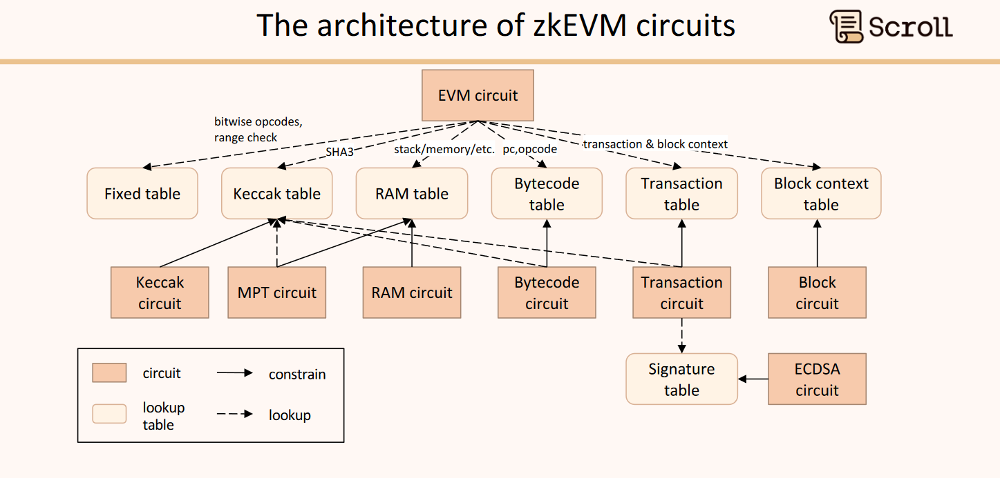

### Presentation by Ye from Scroll
Scroll is one of the most popular zk-rollups on Ethereum.

The team targets bytecode equivalence with EVM, which differs from, for example, zkSync because the latter has equivalence only on the language level and then compiles it to a different set of bytecode operations. The next level would be the consensus equivalence.

From the developer's perspective, Scroll is the same as EVM. You can use all the tooling (Foundry, ethers.js, Hardhat, etc.), same as on L1, and dApps are only required to change the RPC link. Scroll's zkEVM is also currently the only rollup that supports ecPairing.

Referring to Vitalik's types of equivalence, Scroll is aiming for type 2, but currently, it is the type 3.

#### zkEVM circuit arithmetization
Scroll uses the combination of Plonkish arithmetization + Plonk IOP + KZG polynomial commitment scheme.

The reasons why Scroll has chosen Plonkish:
- Efficient range proof to use EVM 256-bit words
- Efficient connection of circuits to separate zk-unfriendly opcodes
- Efficient mapping to prove Read&Write consistency
- Efficient on/off selectors to handle a dynamic execution trace

All this is possible because Plonkish allows the use of lookup tables (for the first three), custom gates (for the latest), and permutations to optimize the circuit.

#### Constraints
To generalize the execution of a transaction in zkEVM, Scroll has metadata for every opcode of an execution.

#### Architecture
Scroll zkEVM is made from multiple circuits, similar to zkSync and other rollups.

#### Aggregation
zkEVM circuit is computation-heavy, so Scroll similarly to zkSync, and Linea is using a two-layer proving system:
1. The zkEVM circuit layer is Halo2-KZG with Poseidon hash transcript
2. The aggregation layer is Halo2-KZG with Keccak hash transcript

