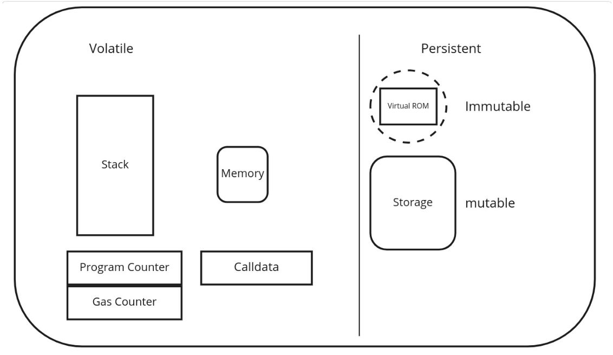

### Introduction to L2
I've been assigned to group number 5, which has ten members in total! At the start of the lesson, we split up into groups (but didn't do anything specific).

More about data availability and the difference between ZKP and Optimistic rollups.
As was mentioned on Day 2, ZKP rollups work on Validity Proofs, while Optimistic rollups work on Fault Proofs.

zkEVM is a VM that emulates the usual EVM but in zero-knowledge math. For example, I know that zkSync compiles smart contracts in two steps: first with Solc and then with zkSolc. The resulting bytecode won't work on EVM, and the set of opcodes is quite different from the usual on Ethereum.

Different implementations of zkEVM thus use different approaches:
- Some are trying to build a full implementation of the EVM circuit
- Some use application-specific circuits for different dApps because it is quite a limitation to build an entire EVM, plus it's not very efficient

The challenge of zkEVM is to make a proof of execution in EVM while the math is different, and you cannot just use the code of EVM. Developers have to describe every possible interaction between the EVM components (see the picture).

#### Data availability (DA)
Possible solutions are:
- DA Sampling (DAS). Each node downloads a small random subset of the total data and thus confirms that the data is available.
- DA Committees (DACs) are trusted parties that provide data and ensure DA. Ethereum, for example, uses a random subset of validators to attest to DA for light nodes.
- (Proto) Danksharding (EIP-4844, in progress)

EIP-4844 introduces a new Ethereum transaction type that holds a special field named *blob* and can hold about 125 kB data in size. Blobs will be committed with the KZG commitment scheme and are only available on the Beacon chain. It won't keep the data forever, only 1-3 months, to allow people to run nodes more efficiently. I read about it some time ago.

L2s can greatly benefit from Proto-Danksharding and reduce their fees by 10-100 times.

#### Hash functions
They are quite common in the modern world, and you probably know about it. Hash functions, like SHA256, produce a deterministic digest from some input. What is interesting is that there are hash functions that are more ZK-friendly than others. For example, Poseidon. See benchmarks of popular functions in Circom: https://eprint.iacr.org/2023/681.pdf

What else do we have from cryptography:
- (Fully) Homomorphic Encryption
- Verifiable Random Functions (VRFs) to get some pseudorandom outputs
- Verifiable Delay Functions (VDFs) to show that some time or computation has happened

#### Numbers and terminology
- Integers Z
- Rational numbers Q
- Real numbers R
- Fields (F or K)
- Modular arithmetic
- Group Theory

Check out one of my posts: https://hey.xyz/posts/0x8218-0x0280-DA-b047fd5f

