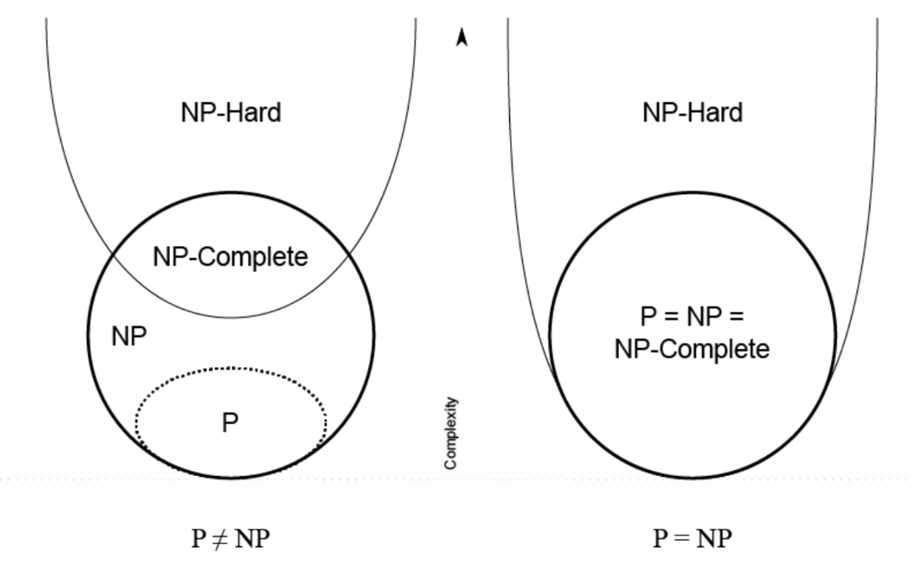
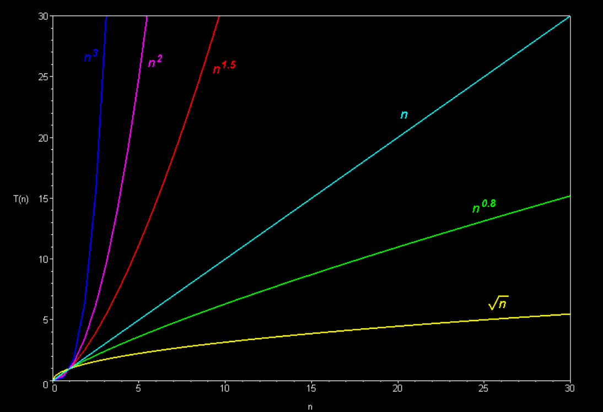
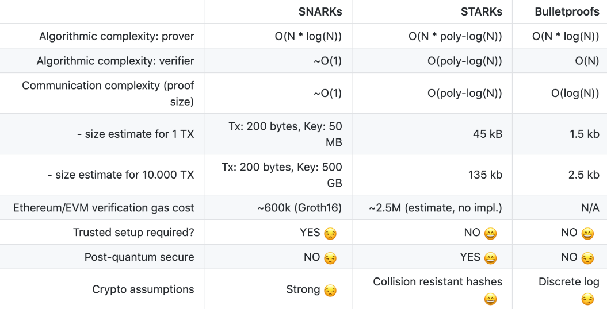

### Math and Cryptography
Today, we continued the previous talk about the underlying math, perhaps the most challenging part of ZKP.

Two good resources:
https://www.rareskills.io/post/set-theory
https://www.khanacademy.org/computing/computer-science/cryptography/modarithmetic/a/what-is-modular-arithmetic

Also, check out one of my previous posts:
https://hey.xyz/posts/0x8218-0x0280-DA-b047fd5f

Most of the topics about groups and sets discussed are described in the articles above, and I don't see the point in rewriting all the concepts.

Interesting quote from Vitalik Buterin about polynomials:
> "There are many things that are fascinating about polynomials. But here we are going to zoom in on a particular one: polynomials are a single mathematical object that can contain an unbounded amount of information (think of them as a list of integers and this is obvious)."

Schwartz-Zippel Lemma: "different polynomials are different at most points" (but not all). For example, two polynomials of the degree 8 can intersect at no more than 8 points if they are not equal.

If you have some set of points (e.g. {1, 3}, {6, 10}, {8, 0}) then doing a Lagrange interpolation on those points gives you a polynomial that passes through all of those points.
Try it: https://www.wolframalpha.com/input?i=interpolating+polynomial+%7B1%2C+3%7D%2C+%7B6%2C+10%7D%2C+%7B8%2C+0%7D

We can represent polynomials in two forms:
1. Coefficient form
2. Point value form

Complexity theory studies the time or space requirements to solve problems based on input size. Problems can be classified based on the time required to find a solution, and the time needed grows with the size of the input n.

"Everything provable is provable in zero knowledge" (careful, very long paper):
https://dl.acm.org/doi/pdf/10.5555/88314.88333

Big O describes the complexity of some code using algebraic terms.

#### Zero Knowledge Proof
Comparison of different ZKP systems:

Check out another post of mine: https://hey.xyz/posts/0x8218-0x02a1

Non-interactivity can enable multiple verifiers to verify a proof without querying the prover.
Succinctness is only necessary if storing proofs is costly or verification time is critical.
A proof of knowledge is more valuable than a simple true statement proof.
In a proof, soundness holds against an unbounded prover, and in an argument, only against a polynomially-bounded prover.

